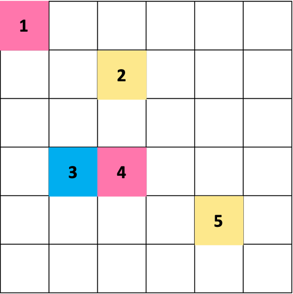

# `block` Customization Point Design

<!-- vscode-markdown-toc -->
* [Motivation](#Motivation)
* [Construction](#Construction)
	* [BCSR Construction](#BCSRConstruction)
	* [Using MdSpan](#UsingMdSpan)
* [Application](#Application)
	* [SpMV](#SpMV)

<!-- vscode-markdown-toc-config
	numbering=false
	autoSave=true
	/vscode-markdown-toc-config -->
<!-- /vscode-markdown-toc -->

## <a name='Motivation'></a>Motivation

Existing customization points include `row`, `column` and `diagonal`. Besides these, block view is known as a common view for parallelism. Therefore, `block` view is adopted as a new cp.

## <a name='Construction'></a>Construction
Here we implement BCSR format as a representative blocked sparse format. 

### <a name='BCSRConstruction'></a>BCSR Construction

```
mc::bcsr_matrix_view view(values.begin(), rowptr.begin(), colind.begin(),
                          shape, block_height, block_width, nnz);
```

We need to pass 7 arguments to construct a BCSR view.
+ `values` is the array contains the entries of blocks from original matrix;
+ `rowptr` is the array contains the starting point of each row with block view in `values` array;
+ `colind` is the array contains the column index of each block;
+ `shape` is the size of the original matrix;
+ `block_height` is the first dimension of block;
+ `block_width` is the second dimension of block;
+ `nnz` is the number of non-zero elements in original matrix.

For example, for matrix $A$ as follow:

$$
A = \left(
\begin{matrix}
0 & 2.42  & 0 & 0 & 0 & 0 \\
59.26 & 0 & 0 & 0 & 0 & 0 \\
0 & 0 & 0 & 0 & 0 & 0 \\
85.34 & 91.42 & 82.82 & 0 & 0 & 0\\
0 & 0 & 0 & 0 & 0 & 0\\
0 & 0 & 0 & 0 & 0 & 0\\
\end{matrix}
\right)
$$

Its `values`, `rowptr` and `colind` arrays are as follows:
```
values: [0, 2.42, 59.26, 0, 0, 0, 85.34, 91.42, 0, 0, 82.82, 0]
rowptr: [0, 1, 3, 3]
colind: [0, 0, 2]
```
It's recommended to use provided `mc::generate_bcsr` function to directly generate random benchmark by providing the size of matrix and block and number of non-zeros.
```
auto [values, rowptr, colind, shape, a_nnz] =
    mc::generate_bcsr(m, n, block_height, block_width, nnz);
```

### <a name='UsingMdSpan'></a>Using MdSpan

Another idea is to use `std::mdspan` to construct views for BCSR format.

```c++
auto [values, rowptr, colind, shape, a_nnz] =
    mc::generate_bcsr(m, n, block_height, block_width, nnz);

std::experimental::mdspan a(values(), m, n);

for (auto && [{bx, by}, block] : mc::blocks(a)) {
  auto values = std::ranges::views::values(block);
  fmt::print("A {} x {} block at {}, {} containing values {}\n",
                   block_height, block_width, bx, by, values);
}
```

## <a name='Application'></a>Application 

### <a name='SpMV'></a>SpMV

The processing flow of SpMV $c=Ab$ is designed as follows:
+ Iterate over each block in a sparse matrix. The block iterator is provided by specific interface. The details is transparent to user.
+ Iterate over each element in block and calculate its indices to determine the corresponding indices in $b$ and $c$. Add the resul back to $c$.
+ Here we assume each block is a `dense_matrix_view`.

```c++
for (auto&& [{bx, by}, block] : view.blocks()) {
  auto x_base = bx * view.shape()[1];
  auto y_base = by * view.shape()[0];
  for (auto i : __ranges::views::iota(I(0), block.shape()[0])) {
    for (auto j : __ranges::views::iota(I(0), view.shape()[1])) {
      if (0 == block[{i, j}]) continue;
      for (auto kk : __ranges::views::iota(I(0), I(k))) {
        auto x_addr = x_base + i;
        auto y_addr = y_base + j;
        I b_addr = col_addr * k + kk;
        I c_addr = col_addr * k + kk;
        C[c_addr] += block[{i, j}] * B[b_addr];
      }
    }
  }
}
```

### Parallelism 

We design user interface for parallelism as
```
mc::parallel_spmv(N, A, Fn);
```

+ `N` is the number of processors specified by user;
+ `A` is input sparse matrix;
+ `Fn` is the function applied on each block. By capturing by references in lambda functions, it's possible to avoid passing both input vector `b` and output vector `c` into the function.

Two problems should be addressed within the function implementation of `mc::parallel_spmv`:
1. Resource conflict. The computation for blocks on the same row require access to the same part of vector `b`. To avoid unnecessary data movement, computation for blocks located on the same row should be perfromed on the same processor. For example, the multiplcation for block 3 and 4 should be on the same processor;
2. Load balance. Balancing the computation load across different processors is beneficial for reducing the algorithm's execution time.



The pseudo code of the function is as follow:
```c++
template <typename T>
concept has_block_method = requires(T& t) {
  { t } -> __ranges::random_access_ranges;
  { t.blocks() } -> __ranges::forward_range;
  { t.blocks() } -> __ranges::view;
};

template <std::size_t N, has_block_method R, typename Fn>
constexpr void parallel_spmv(integer<N> unroll_factor, R&& r, Fn&& fn) {
  auto task_lists = task_division(N, r.blocks());
  task_assign(task_lists, fn);
}
```
Here we use concept `has_block_method` to impose the requirements to have a `blocks` cpo on the passed range. The general process of the function is outlined in pseudo-code: first, implement task partitioning considering aforementioned resource conflicts, and then parallelize task execution based on specific hardware. 

The idea in this section is referenced from [SparseACC](https://www.research-collection.ethz.ch/handle/20.500.11850/642508).

### Load balancing 

In addition to considering load balancing at the block level, we can also aim to make each block as compact as possible when partitioning. Making different blocks close to being dense can help reduce the disparity in the number of non-zero elements between different blocks.

The idea is referenced from [Cache-Oblivious, SIAM'09](https://www.researchgate.net/profile/Albert-Jan-Yzelman-2/publication/220411645_Cache-Oblivious_Sparse_Matrix-Vector_Multiplication_by_Using_Sparse_Matrix_Partitioning_Methods/links/5465dbf70cf2052b509fb9fa/Cache-Oblivious-Sparse-Matrix-Vector-Multiplication-by-Using-Sparse-Matrix-Partitioning-Methods.pdf). This paper permute unstructured sparse matrix into SBD(separated block-diagonal) structure.

```
permute(A)
```

+ `A` is input sparse matrix.

The function design is yet to be completed.

